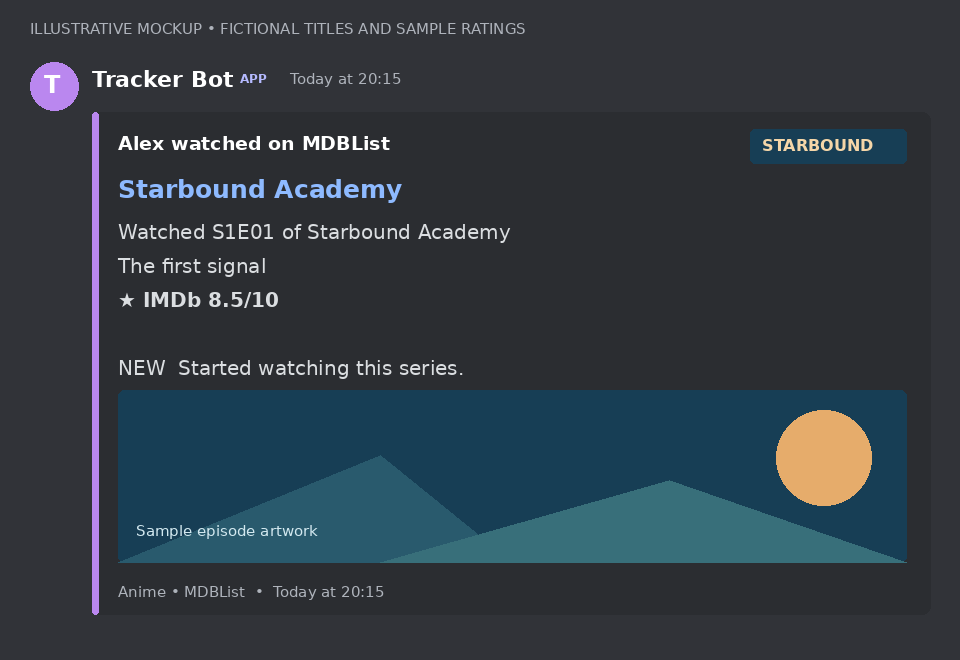
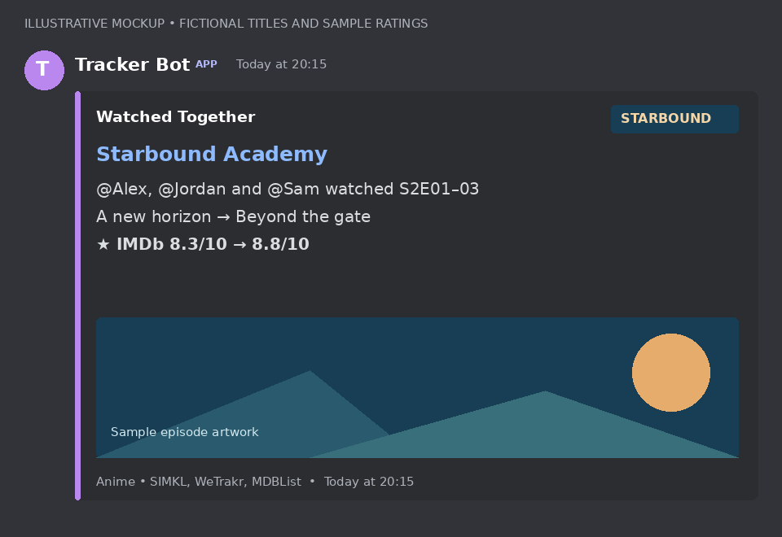
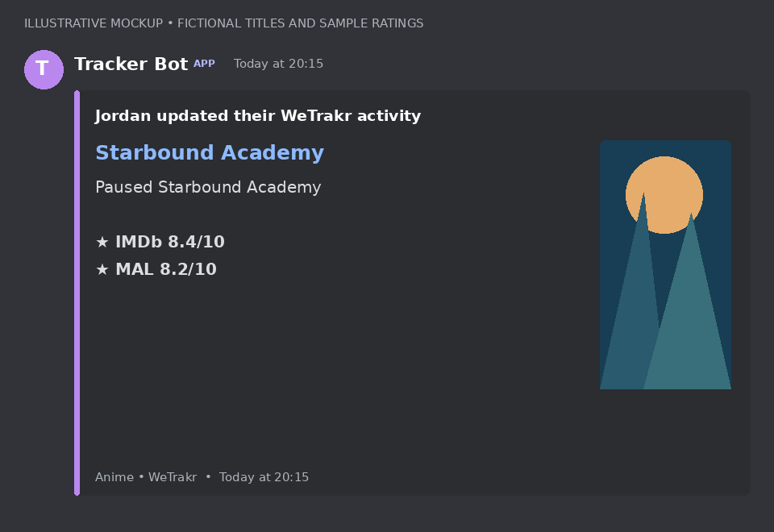

# SIMKLTrackerBot

A self-hosted, multi-tracker Discord bot for **SIMKL, WeTrakr and MDBList**. Share watch activity, discover what to watch next, and earn shared XP, achievements and prestige through one set of `/tracker-*` commands.

> This README describes the **experimental** branch. Its Docker image is `ghcr.io/donnyfly/simkltrackerbot:experimental`. The `latest` image follows the main branch and may not include these features.

## Activity previews

These are **illustrative Discord-style mockups**, with fictional titles, users, artwork and ratings—not live Discord screenshots. Actual artwork, scores and formatting depend on available metadata and your selected style.

**Anime episode:** individual episode IMDb rating, title logo, episode artwork, and the first-episode notice below the ratings.



**Watched Together:** members using different providers can share one activity embed.



**Status activity:** poster artwork and title-level ratings; anime statuses can include MAL.



Regenerate these examples with `python scripts/render_readme_previews.py` after installing Pillow. They demonstrate presentation rules rather than exercising live provider delivery.

## What the bot supports

- Each member links accounts and selects one activity source **per Discord server**. A server can contain SIMKL, WeTrakr and MDBList members together.
- The selected provider supplies activity, watch history, watch totals, watching and planned lists, random picks, and recommendation history/exclusions.
- XP, levels, ranks and prestige remain shared progression for the Discord user. Achievements, challenges, community goals, leaderboards and recaps use the common tracking system.
- First imports and source-switch catch-up are quiet: existing history does not flood the channel with activity or old progression animations.
- A shared occurrence ledger matches confirmed duplicate watches across providers so the same watch earns XP once. Genuine rewatches remain separate occurrences. Uncertain identities require review rather than a title-only guess.
- Switching sources does not itself deduct XP. A removal reverses its contribution when no other imported provider observation supports that occurrence. Changes on an inactive account become known when that account is synced again.
- `/tracker-mapping` privately previews verified matches, unpaired watches, review cases and possible double XP awards. It does not change XP.

### Embeds and presentation

Titles and activity headers link to the provider's title and member pages when available. Rich activity can include title logos, movie backdrops, episode stills, episode titles and ratings. Status activities use posters. Personal and server styles control artwork, detail, episode labels and rating visibility.

Watched TV and anime episodes use **individual episode IMDb ratings**. They do not show MAL or substitute the whole show's IMDb score when an episode score is missing. Anime movies and anime status activities can show title-level IMDb and MAL scores. Episode ranges can show the first and last episode's scores when available.

A watch beginning at **S1E1**, including a range starting there, displays **“🆕 Started watching this series.”** on the last line after a blank line. Anime display numbering is mapped separately from provider metadata coordinates, so artwork and ratings can still use the original episode identity.

**Watched Together** works across all three providers, including mixed-provider groups. Matching requires the same server/channel, a shared title identity, the same movie or episode/range, and watch times within 30 minutes. Partial-overlap ranges remain separate. Group descriptions show at most five member mentions without pinging them. Delivery must succeed before pending watch state and XP are committed.

### MDBList tracking

MDBList tracking uses each member's OAuth account, independently of the optional MDBList ratings API key. It supports watched activity, history, lists, discovery and shared progression. Playback can supply paused notices and in-progress movies. Ended/cancelled shows use **Completed**; ongoing shows use **Caught up with**.

Its journal invalidates affected title histories rather than acting as a play-event feed. The bot uses targeted refreshes where possible, safe full-history fallbacks, quiet recovery after expired journals, and per-account quota backoff. Stable play identities are used for reconciliation.

## Commands

Members use the same commands whichever provider they select. Administrative commands require the relevant server permissions.

| Command | Purpose |
| --- | --- |
| `/tracker-link` | Authorize and link a SIMKL, WeTrakr or MDBList account. |
| `/tracker-unlink` | Remove a provider link in this server. |
| `/tracker-source` | Select the linked provider to track in this server. |
| `/tracker-status` | Admin: inspect links, selected sources and sync health; optionally select `user: @username`. Server results are paginated in groups of five members. |
| `/tracker-checknow` | Admin: check members' selected sources immediately. |
| `/tracker-stats` | Show a visual profile with selected-source watches and shared progression. |
| `/tracker-mapping` | Privately inspect cross-provider watch matching and possible duplicate awards. |
| `/tracker-achievements` | Show achievements and progress. |
| `/tracker-challenges` | Show daily and weekly challenges. |
| `/tracker-community` | Show the server's weekly community challenge. |
| `/tracker-leaderboard` | Show the server leaderboard with bounded member displays. |
| `/tracker-server-stats` | Show combined server watch statistics. |
| `/tracker-weekly-recap` | Admin: post a weekly watch recap. |
| `/tracker-watching` | Show the selected account's watching list and next episodes where available. |
| `/tracker-random` | Pick from the selected account's planned list. |
| `/tracker-recommend` | Recommend titles using selected-source history and exclusions. |
| `/tracker-style` | Choose your activity presentation. |
| `/tracker-style-server` | Admin: set server presentation defaults. |
| `/tracker-setchannel` | Admin: choose the activity channel. |
| `/tracker-features` | Admin: configure optional features, including activity-only mode and Watched Together. |
| `/tracker-timezone` | Admin: view or set the server timezone. |
| `/tracker-user-reset` | Reset this server's imported tracking state and achievements while retaining account links, global XP and personal style; history is quietly reimported. Read the confirmation before proceeding. |
| `/tracker-debug` | Admin: privately preview level, rank, achievement and prestige notifications without changing XP. This is a progression-card preview, not an activity-embed preview. |

## Host setup

### Credentials

Create a Discord application/bot and invite it with the `bot` and `applications.commands` scopes. Allow **View Channel, Send Messages, Embed Links, Attach Files and Read Message History** in the activity channel.

Copy `.env.example` to `.env` and configure:

| Variable | Purpose |
| --- | --- |
| `DISCORD_BOT_TOKEN` | Required Discord bot secret. |
| `SIMKL_CLIENT_ID` | Required SIMKL application ID. Startup currently requires it even if members select another provider. |
| `TMDB_API_KEY` | Required TMDB metadata/artwork key. |
| `WETRAKR_API_KEY` | Host application key enabling WeTrakr integration. |
| `MDBLIST_CLIENT_ID` | Host OAuth application ID enabling MDBList tracking. Register your application at [MDBList Developer](https://mdblist.com/developer/) with device authorization. |
| `MDBLIST_CLIENT_SECRET` | Set only if your registered MDBList application requires it for refresh. |
| `MDBLIST_API_KEY` | Optional IMDb/MAL metadata enrichment; separate from member OAuth tracking. |
| `POLL_INTERVAL_MINUTES` | Shared scheduled polling interval for all providers; default `60`. |
| `POLL_CONCURRENCY` | SIMKL user polling concurrency; default `5`. |
| `HISTORY_BACKFILL_CONCURRENCY` | SIMKL history backfill concurrency; default `2`. |
| `SIMKL_DEFAULT_TIMEZONE` | Default statistics/streak timezone, retaining its legacy variable name; default `Asia/Singapore`. Override per server with `/tracker-timezone`. |
| `DISCORD_DEV_GUILD_ID` | Optional development server ID for immediate slash-command synchronization. |
| `IMDB_RATINGS_DB_PATH` | Optional generated IMDb episode-rating database path; default `data/imdb_ratings.db`. |

**Members authorize their own accounts through `/tracker-link`; they do not need the host's API credentials.** Each self-hoster supplies their own application credentials. Keep `.env`, OAuth tokens and the persistent data directory private; never commit them or share diagnostic dumps containing secrets.

### Docker Compose

```yaml
services:
  trackerbot:
    image: ghcr.io/donnyfly/simkltrackerbot:experimental
    restart: unless-stopped
    env_file: .env
    volumes:
      - ./data:/app/data
```

Start with:

```bash
docker compose pull
docker compose up -d
docker compose logs -f
```

Keep the data volume across upgrades: it stores linked accounts, sync positions, mapping/occurrence state and progression. Back it up privately before upgrading. After changing `.env`, recreate the container so it receives the new values.

### Run from source

The Docker image uses Python 3.13. For a matching local environment:

```bash
git clone --branch experimental https://github.com/donnyfly/SIMKLTrackerBot.git
cd SIMKLTrackerBot
python3.13 -m venv .venv
source .venv/bin/activate
pip install -r requirements.txt
cp .env.example .env
# Fill in .env before starting.
python bot.py
```

### First use

1. An administrator runs `/tracker-setchannel` and configures `/tracker-features` and `/tracker-timezone` as desired.
2. Each member runs `/tracker-link` for their provider and `/tracker-source` to select it.
3. Run `/tracker-checknow` to seed history quietly. Mark a new watch **after** that baseline, then wait for polling or check again.
4. Review `/tracker-stats`, `/tracker-status` and `/tracker-mapping` to confirm the account, source and import state.

Missing activity? Check the selected source, account authorization, channel permissions and import health first. An initial quiet baseline is expected. Missing artwork or episode ratings can reflect unavailable metadata. A “no active SIMKL targets” log is normal when everyone selects another provider. Quota backoff or provider errors appear in sync health; avoid repeatedly forcing checks during a quota delay.

## Development and validation

Implementation lives in `trackerbot/`: shared tracking/progression in `core/`, provider clients and sync in `integrations/`, metadata resolution in `metadata/`, and embeds/cards in `presentation/`. The root `bot.py` remains the launch entry point.

- [Multi-tracker architecture and identity mapping](docs/multi-tracker-design.md)
- [Adding another provider: interface, capabilities and parity checklist](docs/adding-provider.md)
- [MDBList integration details and limitations](docs/mdblist-integration.md)
- [Multi-tracker live validation checklist](docs/testing-multi-tracker.md)
- [WeTrakr API review](docs/wetrakr-api-review.md)

The shared interface and mapping ledger provide the foundation for future providers. Adding one still requires an adapter, authentication, API-specific reconciliation and capability validation; the bot does not promise automatic parity for features a provider cannot supply. Recent shared delivery and MDBList updates have automated coverage; the linked checklist records the live account/Discord checks still required.

## License

[MIT](LICENSE)
